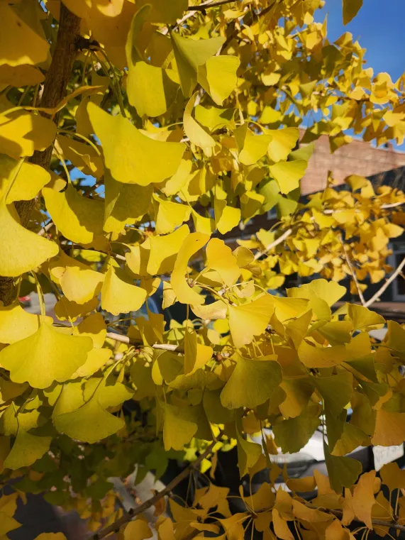

# DitherPal

A fast, feature-rich dithering desktop application built with PyQt6. Supports images and video with multiple dithering algorithms, full color modes, infinite upscaling, and Numba JIT acceleration.

---

## Examples

### Still Image

<table>
  <tr>
    <th>Original</th>
    <th>B&W Dither</th>
    <th>Full Color Dither</th>
  </tr>
  <tr>
    <td></td>
    <td></td>
    <td></td>
  </tr>
</table>

### Video

<table>
  <tr>
    <th>Original</th>
    <th>B&W Dither</th>
    <th>Full Color Dither</th>
  </tr>
  <tr>
    <td>
      <a href="https://youtu.be/6NttwZXAyww"></a>
    </td>
    <td>
      <a href="https://youtu.be/xMnGWsTfyyQ"></a>
    </td>
    <td>
      <a href="https://youtu.be/2U1-oRuyZfI"></a>
    </td>
  </tr>
</table>

---

## Features

- **Multiple dithering algorithms** — Floyd-Steinberg, Jarvis-Judice-Ninke, Bayer (2×2, 4×4, 8×8), Ordered, Rosette Pattern, Text Pattern
- **Color modes** — Black & White, Full Color Spectrum, Custom palette
- **Infinite upscaling** — Super-sample before dithering for ultra-sharp output at any resolution
- **Video support** — Process MP4, AVI, MOV, MKV, WebM and more; outputs upscaled dithered MP4
- **Numba JIT acceleration** — Compiled dithering kernels for near-native CPU performance
- **Multithreaded video processing** — Parallel frame batches scale to available CPU cores

---

## Requirements

```
PyQt6
numpy
Pillow
numba
opencv-python
scikit-learn  # optional, improves full-color palette generation
```

Install all dependencies:

```bash
pip install PyQt6 numpy Pillow numba opencv-python scikit-learn
```

---

## Usage

```bash
python ditherpal.py
```

1. Drag and drop or open an image/video file
2. Choose a dithering method and color mode
3. Set an upscale factor (e.g. 4× for sharper dithering)
4. Click **Process** — output saves automatically alongside the source file

---

## Dithering Methods

| Method | Description |
|--------|-------------|
| Floyd-Steinberg | Error-diffusion; smooth gradients, natural look |
| Jarvis-Judice-Ninke | Wider error spread; finer detail retention |
| Bayer 2×2 / 4×4 / 8×8 | Ordered threshold matrix; structured, retro feel |
| Ordered Dither | 4×4 Bayer variant |
| Rosette Pattern | CMYK halftone dot screening |
| Text Pattern | Custom text tiled as a halftone mask |

---

## Acknowledgements

Special thanks to **[LeoBorcherding](https://github.com/LeoBorcherding)** / **[BlueberryMathematics](https://github.com/BlueberryMathematics)** for color dithering implementation and speed optimizations.
